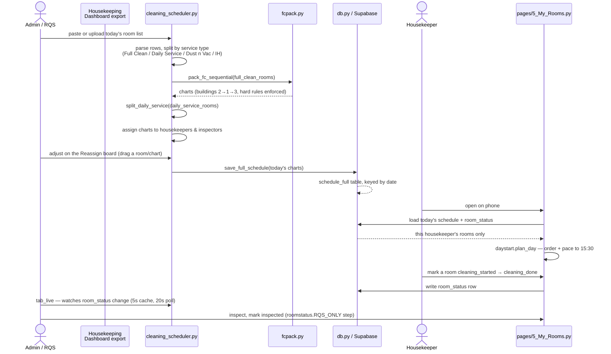

# Project map — BGV Scheduling

One page to get from "I need to change X" to the right file, without reading
six others first. It complements two documents that already exist and are not
duplicated here:

- **`CLAUDE.md`** — the reasoning behind non-obvious decisions, and every trap
  that has already cost a day. Read it before touching the Full Clean packer,
  Daily Service, `daystart.py`, or anything that writes to `room_status`.
- **`.claude/skills/bgv-map/SKILL.md`** — task-oriented: "I want to change the
  room card / the boards / the staff sheet" → the exact function.

This document answers a different question: **what is here, how does it fit
together, and who is allowed to see it.** Line counts below are measured
against the repo as it stands, not carried over from memory — re-run the
`wc -l` in the Appendix if this drifts.

## What the app is

A Streamlit app that turns a morning's room list into cleaning charts, hands
each housekeeper her rooms on a phone, and lets an RQS (inspector) watch and
correct the floor as the day runs. One property: Grand Colorado on Peak Eight,
Breckenridge, three buildings, ~245 rooms. Data lives in Supabase. The team is
largely Spanish-speaking, so the pages they use are bilingual.

## Module map

```mermaid
graph TD
    subgraph entry["Entry point"]
        CS["cleaning_scheduler.py<br/>6,748 lines<br/>login · generate · Reassign · Live"]
    end

    subgraph pages["pages/ — one file per nav tab"]
        P1["1_Dashboard.py<br/>362"]
        P2["2_Admin.py<br/>414"]
        P3["3_Roster_Import.py<br/>1,841"]
        P4["4_My_Home.py<br/>371"]
        P5["5_My_Rooms.py<br/>965"]
        P6["6_Property.py<br/>778"]
        P7["7_Profile.py<br/>87"]
    end

    subgraph core["Core, no Streamlit — testable alone"]
        FCPACK["fcpack.py<br/>533<br/>Full Clean packer"]
        PMAP["property_map.py<br/>603<br/>the building's shape"]
        DAY["daystart.py<br/>302<br/>ordering + pacing"]
        RI["roster_import.py<br/>1,600<br/>staff-sheet parser"]
        STAFF["staffing.py<br/>229<br/>headcount arithmetic"]
        FC["forecast.py<br/>246<br/>dashboard-export reader"]
    end

    subgraph shared["Shared services"]
        DB["db.py<br/>868 · 63 functions<br/>the only Supabase caller"]
        AUTH["auth.py<br/>155<br/>roles & permissions"]
        SESS["session.py<br/>210<br/>cookie sign-in"]
        UI["ui.py<br/>333<br/>nav + i18n install"]
        I18N["i18n.py + i18n_es.py<br/>402 + 494"]
        RS["roomstatus.py<br/>105<br/>the one status vocabulary"]
        ASG["assignments.py<br/>92"]
        CLK["clock.py<br/>35<br/>property-local time"]
    end

    CS --> AUTH & DB & FCPACK & PMAP & UI
    P1 --> AUTH & DB & DAY & RS & UI & CLK
    P2 --> AUTH & DB & UI
    P3 --> AUTH & DB & RI & STAFF & FC & UI & CLK
    P4 --> AUTH & DB & RI & UI & CLK
    P5 --> AUTH & DB & PMAP & RS & ASG & I18N & UI & CLK & DAY
    P6 --> AUTH & DB & PMAP & RS & I18N & UI & CLK
    P7 --> AUTH & DB & SESS & I18N & UI

    UI --> AUTH & I18N
    ASG --> DB & CLK
    SESS --> DB & CLK
    DB --> CLK
    DAY --> PMAP

    style CS fill:#2563a8,color:#fff
    style DB fill:#7c3aed,color:#fff
    style FCPACK fill:#0d9488,color:#fff
    style PMAP fill:#0d9488,color:#fff
```



**Reading it:** `db.py` is the only module that talks to Supabase — nothing
else imports the client. `property_map.py` and `fcpack.py` have zero Streamlit
and zero `db` dependency, which is why they are the modules with throwaway
`AppTest`-free unit tests. `daystart.py` depends on `property_map` for travel
costs and nothing else.

## Every file, what it owns

| file | lines | owns |
|---|---:|---|
| `cleaning_scheduler.py` | 6,748 | entry point, login, Full Clean/Daily Service grouping, staff assignment, Reassign board, Live board — see the line map below |
| `pages/3_Roster_Import.py` | 1,841 | weekly staff sheet: upload, diff, week/month views, Plan a week, attendance |
| `roster_import.py` | 1,600 | the staff-sheet parser. No Streamlit — testable alone |
| `pages/5_My_Rooms.py` | 965 | the phone page: a housekeeper's own rooms, or an RQS's whole team |
| `db.py` | 868 | every Supabase read and write — 63 functions, nothing else touches the client |
| `pages/6_Property.py` | 778 | the property in 3-D (Three.js) or a flat plan, coloured by room status |
| `property_map.py` | 603 | the building's shape, travel costs, bridges. No Streamlit |
| `fcpack.py` | 533 | Full Clean packer: the hard rules, the search, slack-gathering, walk-shortening |
| `i18n_es.py` | 494 | ~340 Spanish phrases |
| `pages/2_Admin.py` | 414 | accounts and sign-in history |
| `i18n.py` | 402 | the language switch; wraps Streamlit's text calls |
| `pages/4_My_Home.py` | 371 | one person's own week, read from the staff sheet |
| `pages/1_Dashboard.py` | 362 | today's floor as a timeline, one bar per room |
| `ui.py` | 333 | top navigation and shared chrome |
| `daystart.py` | 302 | what to clean first and when — a forward simulation, not a sort |
| `forecast.py` | 246 | reads a multi-day Housekeeping Dashboard export into per-day workload |
| `staffing.py` | 229 | how many housekeepers and RQS a day needs |
| `session.py` | 210 | staying signed in across a refresh (cookie written from the page) |
| `auth.py` | 155 | roles, permissions, login/logout |
| `roomstatus.py` | 105 | the one vocabulary for a room's state — phone page and Live board both read it |
| `assignments.py` | 92 | who is on which rooms today, shared by page and nav |
| `pages/7_Profile.py` | 87 | change your own password |
| `clock.py` | 35 | property-local time; the one place `date.today()` is allowed |

### Inside `cleaning_scheduler.py`

Six thousand lines in one file is real; this is where each part lives.

| region | what's there |
|---|---|
| Constants | `SVC_*` service types, `MAX_FC` 380, `LOW_MIN` 330, `DS_CAP` 460 |
| CSS | shared page styling, the width cap that every page must match |
| Full Clean grouping | `pack_fc_ordered` (annealed, unused), `pack_fc_sequential` (**live**), `_fc_fill_up`, `_tidy_full_clean`, `solve_full_clean` |
| Daily Service | `split_daily_service`, `_ds_by_building`, `_ds_hops` |
| Session state | `_init_state`, `_auto_apply_today`, `_save_reassignment`, undo |
| Login gate | the sign-in form on the entry page itself |
| Staff assignment | charts → housekeepers and inspectors, `_chart_place`, `_insp_travel_score` |
| HTML builders | the chart cards, `_hk_cell`/`_rqs_cell`/`_rooms_cell` |
| Sidebar | attendance, RQS roles, Daily Service team |
| Main flow | input → snapshot → Generate → three tabs |
| Tabs | `tab_sched` (the built schedule), `tab_reassign` (drag between people), `tab_live` (today, as it runs) |

## Pages, roles, and what gates them

| page | nav label | who can open it | what a lower role sees instead |
|---|---|---|---|
| `cleaning_scheduler.py` | *(the app itself)* | anyone signed in | — |
| `pages/1_Dashboard.py` | Dashboard | `can_view_dashboard` — admin, rqs | "Dashboard requires RQS or Admin role." |
| `pages/2_Admin.py` | Admin | `can_manage_users` — admin only | "Admin access required." |
| `pages/3_Roster_Import.py` | Roster Import | `can_generate` — admin, rqs | "This page is for admins and RQS." |
| `pages/4_My_Home.py` | My Home | anyone signed in | `can_manage_users` unlocks *browsing someone else's* week; otherwise it's your own |
| `pages/5_My_Rooms.py` | My Rooms | anyone signed in | `can_manage_users` unlocks *browsing the whole team*; a housekeeper sees only their own rooms and, if `can_view_insp_tab`, an inspector view |
| `pages/6_Property.py` | Property | `can_view_insp_tab` — admin, rqs | "This page is for managers and RQS." |
| `pages/7_Profile.py` | Profile | anyone signed in | — |

Full permission table lives in `auth.py:ROLE_PERMISSIONS` — three roles
(`admin`, `rqs`, `housekeeper`), nine named permissions, no inheritance; a role
either has a permission or it does not.

## Data flow: a morning, start to finish



## Where the data lives (Supabase)

| table | keyed by | holds |
|---|---|---|
| `schedule_full` | `date` | today's built charts — the output of Generate |
| `room_status` | `date` + `room` | one row per room per day: `status, group_label, housekeeper, inspector, started_at, cleaned_at, inspected_at, marked_clean_at, notes, swapped_from, updated_by, updated_at` — no other columns exist; an unknown one makes PostgREST reject the whole write |
| `app_users` | `username` | accounts, roles, display names |
| `login_events` | — | sign-in history, read by Admin |
| `schedule_log` | — | audit trail of schedule changes |
| `app_settings` | a text key | everything with no table of its own: `roster`, `staffsched_*`, `lang_<user>`, `session_<hash>`, `noteseen_<user>`, `fc_mode` (unused, survives) |

`db.py` is the only module permitted to import the Supabase client — see
`CLAUDE.md` if you're tempted to call it from a page directly instead of
adding a function here.

## The building, in brief

`property_map.py` holds the property's real shape: three buildings, bridges
between them (2 and 3 **do not touch** — everything between them routes
through building 1), and what is *not* a guest room (service lifts, chutes,
linen closets). The room code lies twice — digit 0 is two levels (Plaza and
Terrace) and building 3 renumbers its own low plates — so anything that reads
a floor off the room code directly is a bug waiting to be found; read
`property_map.parse()` instead. Full detail and the fixes this has already
needed are in `CLAUDE.md`.

## Running it locally

```bash
python -m streamlit run cleaning_scheduler.py --server.port 8502 --server.address 0.0.0.0
```

Needs `.streamlit/secrets.toml` with `SUPABASE_URL` and `SUPABASE_KEY`
(gitignored — a fresh clone has no database until this is put back; the app
runs but every page shows a connection error without it).

## Appendix — how these numbers were produced

```bash
wc -l *.py pages/*.py                                   # line counts
for f in *.py pages/*.py; do grep -E "^import |^from " "$f"; done   # dependencies
grep -n "auth.can(" pages/*.py                           # permission gates
grep -oE '\.table\("[a-z_]+"\)' db.py | sort -u           # Supabase tables
```

Re-run these rather than trust this file blindly once the code has moved on —
the same caution this file gives about `CLAUDE.md`'s older figures applies to
its own.
